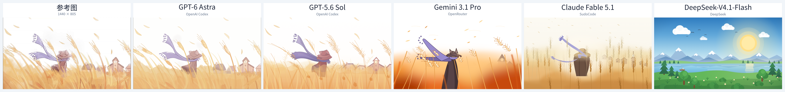
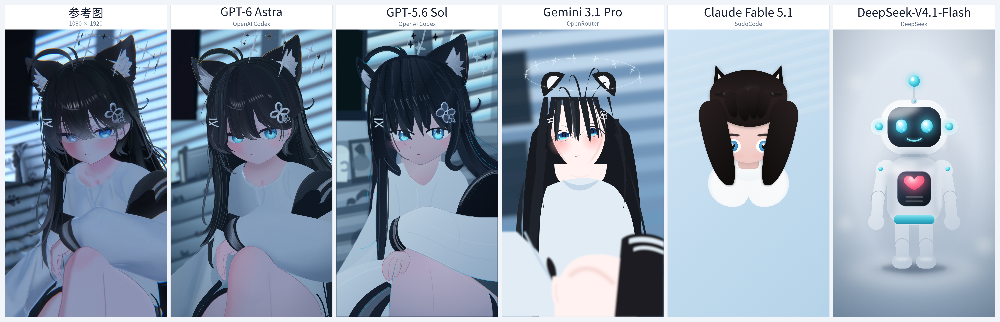
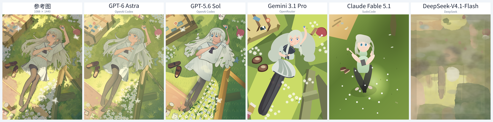

# One-shot HTML/CSS/SVG 图像还原

比较模型根据参考图编写 HTML、CSS 和内联 SVG 的还原效果：单次任务，允许修改代码，但不允许查看自己生成页面的渲染结果。禁止通过自动描图、程序取色、轮廓提取或像素分析等手段获取参考图的线条、颜色和形状数据；只能依据视觉理解编写代码，严格遵循 **视觉 → 代码** 的路径。

## 测试结果

目前包含 **5 个模型 × 3 张图，共 15 份结果**。原始网页位于 [`runs/`](runs/)，下载后用浏览器打开对应的 `index.html`：

```text
runs/<用例>/<渠道--模型>/001/work/index.html
```

各轮目录同时保留实际提示词 `prompt.txt` 和运行信息 `meta.json`。

| 模型 | 渠道 |
|---|---|
| `gpt-6-astra` | OpenAI Codex |
| `gpt-5.6-sol` | OpenAI Codex |
| `google/gemini-3.1-pro-preview` | OpenRouter |
| `claude-fable-5-1` | SudoCode |
| `DeepSeek-V4.1-Flash` | DeepSeek |

## 横向对比

每张图由左至右为：原图、Astra、Sol、Gemini、Claude、DeepSeek。点击图片查看原尺寸。

### 01 · 平面场景

[](comparisons/01-flat-scene.webp)

### 02 · 立体角色

[](comparisons/02-3d-character.webp)

### 03 · 复杂场景

[](comparisons/03-complex-scene.webp)

**样本数较少，仅供娱乐。**
